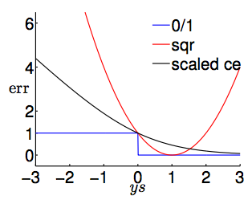

# Machine Learning Foundations #

## Lecture 11-12 ##

---
### Three Linear Model ###

1. Linear Classification
    \\[ h(x) = sign(s)\\]
2. Linear Regression
   \\[h(x) = s\\]
3. Logistic Regression
   \\[h(x) = \theta(s)\\]

---
Error Functions
\\[ s = w^Tx\\]  
-  Linear scoring functions

 Insert y into all error functions

 (ys) : classification correctness score

0/1 \\[error_{0/1}(s,y)= [[sign(ys)\neq1]]\\]

 Scaled so both ce and sqr are a poper upper bound for 0/1. 
They are good bounds for 0/1 problems, and we often set \\(w_0\\) for PLA/pocket/logistic regression. So we often preferred logistic regression for 0/1 classification.

---

##Stochastic Gradient Descent (SGD)

Based on batch-mode (pocket) , logistic regression check all the data at one iteration. Therefore if we extract only one instance, and believe it will be close to expectation over all training dataset.  
Idea: replace true gradient by stochastic gradient, after finite and enough steps, it will be close to average stochastic gradient. It is simple and cheeper, however, it also suffers less stable in nature. 'Soft' PLA. Often we stop SGD on stopping criterions when steps are large enough. Otherwise a proper setting of \\( \eta\\) is \\(0.1\\) .

---

 
##Multiclass prediction##
What will happen under a tie case if we train n classifyers separately? We can try to softly classify them by giving probability on decisions. 
\\[ g(x) = argmax_{k \in y} \theta(w^T_{[k]}x)\\]
Moreover, we can omit logistic function \\(\theta\\). (One-Versus-All Decomposition)
But a problem emerge if we have unbalanced data set. In OVA, the classifier will favor the class with large size.

### One Versus One ###

How we conbine pairwise classifiers? By voting of classifiers. 

